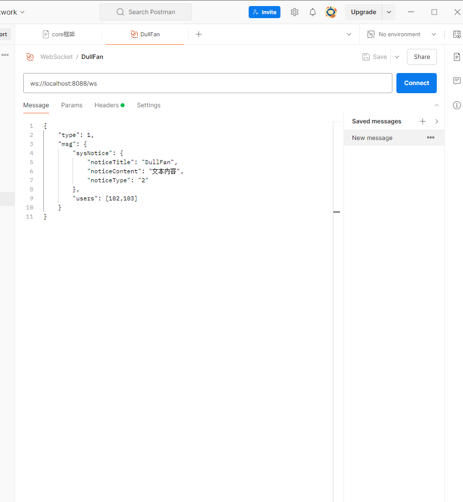

链接地址: ws://localhost:8088/ws

携带请求头: Authorization

参数类型:
```json
{
	"type": 1,
	"msg": {
		"sysNotice": {
			"noticeTitle": "DullFan",
			"noticeContent": "文本内容",
			"noticeType": "2"
		},
		"users": [102,103]
	}
}
```

